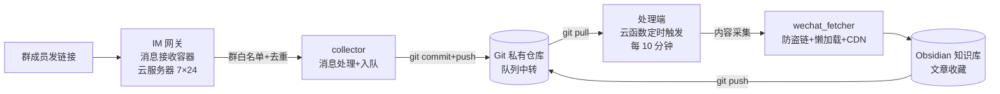

# LabKB · FDE 实验室知识库自动化平台

> 群里发一条链接，系统自动把文章（含图片）抓成标准 Markdown 存进 Obsidian 知识库——**全自动、7×24 无人值守、Git 版本管理**。

FDE（Full-Stack Data Engineering）方向的知识管理落地项目：以 **IM 群消息为采集入口**，**云函数定时任务为处理引擎**，**Git 仓库为消息队列与存储中枢**，构建一套从"消息触发 → 内容采集 → 归档入库 → 版本管理"的完整自动化数据管线。

## ✨ 核心特性

- **一键收藏**：IM 群里发链接即触发采集，无需人工复制粘贴
- **云原生自动化**：采集任务跑在 Serverless 云函数（阿里云 FC / 腾讯云 SCF），定时触发，按量付费，本机可关机
- **Git 即消息队列**：用私有 Git 仓库作为消息队列与数据中转，零运维、天然持久化、失败可回溯
- **内容采集工程**：防盗链处理、懒加载图片解析、CDN 格式推断、浏览器指纹请求头 + 失败重试，图片全量本地化
- **跨网络架构**：接收端与处理端分离，适配不同网络环境对目标站点的访问差异
- **系统自愈**：消息接收进程掉线自动重启，恢复失败时自动写入状态文档通知管理员
- **编码健壮性**：强制 UTF-8 解码，解决跨平台（Windows/Linux/云函数）环境下的中文乱码问题
- **知识库骨架**：附带完整 Obsidian 知识库目录规范（环境/资产/工具/流程/知识/报告），团队开箱即用

## 🏗 系统架构



**组件分工**：

| 组件 | 角色 |
|------|------|
| 云服务器（接收端） | 7×24 在线收消息，群白名单过滤，链接入队 |
| Git 私有仓库 | 消息队列 + 内容存储 + 版本管理，三合一 |
| 云函数（处理端） | 定时触发内容采集，按量付费，无固定成本 |
| Obsidian | 团队阅读与检索界面 |

**设计要点**：消息接收需要"长在线"（常驻进程），内容采集是"周期任务"（按量触发）——两类负载特性不同，分别用常驻服务器和 Serverless 承载，成本最优、互不阻塞。详细设计决策见 [`docs/架构原理.md`](docs/架构原理.md)。

## 🔀 两种部署形态

| | **方案 A：混合架构（本项目默认，实测）** | **方案 B：单机版** |
|---|---|---|
| 拓扑 | 接收服务器 + Git 队列 + 云函数处理 | 一台服务器全包（收 + 采 + 入库） |
| 需要 | 云服务器 + Git 私有仓库 + 云函数 | 一台服务器（轻量即可） |
| 优点 | 全自动、按量付费零固定成本 | 架构最简单，无需队列与云函数 |
| 成本 | 服务器 + 云函数按量（约 3~10 元/月） | 服务器年费（约 50~150 元/年） |

## 📦 项目结构

```
labkb-collector/
├── README.md                # 本文档
├── collector/               # 自动化工具链
│   ├── qq_collector.py          # 消息接收端（IM 网关 → 入队）
│   ├── queue_processor.py       # 本地处理端（备选）
│   ├── cloud_queue_processor.py # 云函数处理端（阿里云 FC / 腾讯云 SCF 通用）
│   ├── wechat_fetcher.py        # 内容采集器（防盗链/懒加载/CDN）
│   ├── bot_watchdog.py          # 掉线自愈看门狗
│   └── build_cloud_package.py   # 云函数打包脚本
├── docs/
│   ├── 架构原理.md           # 架构设计决策记录
│   └── 部署SOP.md            # 分步部署手册
└── kb-template/              # Obsidian 知识库骨架模板
    └── ...                   # 目录规范 + 协作约定 + .gitignore
```

## 🚀 快速开始

```bash
# 1. 克隆知识库骨架
git clone <your-repo> kb && cd kb

# 2. 按 docs/部署SOP.md 完成三步部署
#   ① 消息接收端（服务器/Docker）  ② Git 队列仓库（私有）  ③ 云函数（定时触发）

# 3. 云函数打包（collector/ 目录下）
python build_cloud_package.py   # 产物: cloud_deploy/qq-collector-cloud.zip
```

**云函数环境变量**（凭据不写代码）：

| 变量 | 说明 |
|------|------|
| `KB_GIT_URL` | 队列仓库地址（ssh 或 https） |
| `KB_SSH_KEY` | 部署公钥的私钥全文（仅 ssh 模式） |
| `KB_GIT_USER` / `KB_GIT_EMAIL` | 提交身份（默认 bot） |
| `KB_MAX_PER_RUN` | 每轮采集上限（默认 3，防超时） |
| `KB_GAP_SEC` | 采集间隔秒（默认 15，防限流） |

## 🛡 安全设计

- **凭据不入库**：git 私钥放服务器/云函数环境变量；HTTPS 用系统凭据管理器
- **群白名单**：只处理指定群的消息，防误触发
- **账号隔离**：建议使用专用 IM 账号与个人账号隔离
- **最小权限**：云函数部署公钥独立生成，与服务器公钥分离，可单独吊销

## 📄 许可证

[MIT](LICENSE) © 2026 FDE Lab
