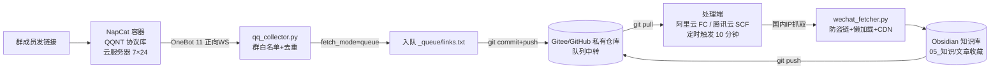

# LabKB Collector · 实验室知识库自动收藏机器人

> 群里发一条微信公众号链接，机器人自动把文章（含图片）抓成 Markdown 存进 Obsidian 知识库，**7×24 无人值守**。

FDE（Full-Stack Data Engineering）实验室知识库落地项目：QQ 群机器人 + 云端队列 + 国内云函数抓取，三端分离的混合架构，解决"公众号文章链接会失效"和"电脑不能 24 小时开机"两个核心痛点。

## ✨ 特性

- **QQ 群一键收藏**：群里发 `mp.weixin.qq.com` 链接，机器人自动接收，无需任何人工操作
- **7×24 无人值守**：云服务器（接收端）+ 云函数（处理端）全部云端化，本机可关机
- **微信反爬三件套**：防盗链 Referer / 懒加载 data-src / CDN wx_fmt 格式推断，图片全量本地化
- **Git 即队列**：用 Gitee/GitHub 私有仓库当消息队列中转，零运维、天然持久化、失败可回溯
- **风控对抗设计**：海外服务器只收消息（微信封锁海外 IP），国内云函数抓取（微信对机房 IP 有风控，已内置浏览器指纹 + 重试）
- **自愈能力**：机器人掉线自动重启恢复；恢复不了时自动写状态文档通知管理员
- **编码安全**：微信页面强制 UTF-8 解码，杜绝云函数环境下的乱码问题

## 🏗 系统架构



**角色分工**：

| 组件 | 角色 | 类比 |
|------|------|------|
| 云服务器（海外） | 24 小时收发室：只收链接、只入队 | 门卫 |
| Git 私有仓库 | 队列邮局：链接与文章的交换中枢 | 邮局 |
| 云函数（国内） | 抓取车间：国内 IP 抓微信 | 车间 |
| Obsidian | 书桌：阅读与检索 | 书桌 |

**为什么是混合架构**：微信公众号对**海外机房 IP** 有风控（HTTP 200 但返回"环境异常"验证页），所以"接收"和"处理"必须分离——海外服务器收 QQ 消息没问题，抓微信必须走国内 IP。详见 [`docs/架构原理.md`](docs/架构原理.md)。

## 📦 项目结构

```
labkb-collector/
├── README.md                # 本文档
├── collector/               # 自动化工具链
│   ├── qq_collector.py          # 服务器接收端（QQ → 入队）
│   ├── queue_processor.py       # 本机处理端（备选，云函数替代品）
│   ├── cloud_queue_processor.py # 云函数处理端（阿里云 FC / 腾讯云 SCF 通用）
│   ├── wechat_fetcher.py        # 微信公众号抓取器（核心）
│   ├── bot_watchdog.py          # 掉线看门狗（自愈）
│   └── build_cloud_package.py   # 云函数打包脚本
├── docs/
│   ├── 架构原理.md           # 为什么这样设计（设计决策记录）
│   └── 部署SOP.md            # 一步步部署手册（实测可用）
└── kb-template/              # Obsidian 知识库骨架模板
    └── ...                   # 目录结构 + 协作约定 + .gitignore
```

## 🚀 快速开始

```bash
# 1. 克隆知识库骨架
git clone <your-repo> kb
cd kb
```

**三步上线的流程**（细节全部在 [`docs/部署SOP.md`](docs/部署SOP.md)）：

| 步骤 | 做什么 | 耗时 |
|------|--------|------|
| 1 | 云服务器部署 NapCat（QQ 协议容器）+ 机器人，群白名单配置 | ~30 分钟 |
| 2 | Gitee/GitHub 建私有仓库做队列中转，配置部署公钥 | ~10 分钟 |
| 3 | 创建云函数（阿里云 FC / 腾讯云 SCF），上传 `collector/` 打包的 zip，配定时触发器 | ~15 分钟 |

```bash
# 云函数打包（在 collector/ 目录执行）
python build_cloud_package.py
# 产物: cloud_deploy/qq-collector-cloud.zip → 上传到云函数控制台
```

**环境变量**（云函数侧配置，凭据不写代码）：

| 变量 | 说明 |
|------|------|
| `KB_GIT_URL` | 队列仓库地址（ssh 或 https） |
| `KB_SSH_KEY` | 部署公钥的私钥全文（仅 ssh 模式） |
| `KB_GIT_USER` / `KB_GIT_EMAIL` | 提交身份（默认 bot） |
| `KB_MAX_PER_RUN` | 每轮抓取上限（默认 3，防超时） |
| `KB_GAP_SEC` | 抓取间隔秒（默认 15，防限流） |

## 🛡 安全设计

- **专用小号**：QQ 机器人必须用注册的专用小号，绝不用主号（非官方协议有封号风险）
- **凭据不入库**：git 私钥放服务器/云函数环境变量；HTTPS 用系统凭据管理器
- **群白名单**：只处理指定群，防误抓
- **异常登录即停**：出现"账号风险/违规"提示立即停止排查，必要时弃号换新（本项目实测换号一次，恢复成本 ~10 分钟）

## ⚠️ 免责声明

本项目仅供技术学习与内部知识管理使用。NapCat 为 QQ 非官方协议实现，存在**账号封禁风险**；云函数机房 IP 抓取公众号受微信风控影响，可能偶发失败。请自行评估合规与风险。

## 📄 许可证

[MIT](LICENSE) © 2026 FDE Lab
