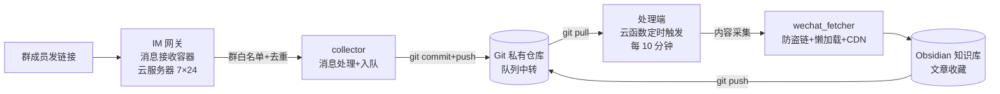

# LabKB · FDE 实验室知识库自动化平台

> 群里发一条链接，系统自动把文章（含图片）抓成标准 Markdown 存进 Obsidian 知识库——**全自动、7×24 无人值守、Git 版本管理**。

**这不是一个工具，是一场 FDE 交付的完整复盘。** 项目以 FDE（Forward Deployed Engineer，前沿部署工程师）的方式交付：驻扎真实业务现场（IM 群）、直面原始问题（链接失效、环境差异、无人值守）、边探索边构建——从"消息触发 → 内容采集 → 归档入库 → 版本管理"搭出完整自动化数据管线（**IM 群消息为采集入口，云函数定时任务为处理引擎，Git 仓库为消息队列与存储中枢**），并最终把现场方案抽象成可复用的知识库骨架与一键部署包（碎石路 → 铺装公路）。

## ✨ 核心特性

- **一键收藏**：IM 群里发链接即触发采集，无需人工复制粘贴
- **云原生自动化**：采集任务跑在 Serverless 云函数（阿里云 FC / 腾讯云 SCF），定时触发，按量付费，本机可关机
- **Git 即消息队列**：用私有 Git 仓库作为消息队列与数据中转，零运维、天然持久化、失败可回溯
- **内容采集工程**：防盗链处理、懒加载图片解析、CDN 格式推断、浏览器指纹请求头 + 失败重试，图片全量本地化
- **跨网络架构**：接收端与处理端分离，适配不同网络环境对目标站点的访问差异
- **系统自愈**：消息接收进程掉线自动重启，恢复失败时自动写入状态文档通知管理员
- **编码健壮性**：强制 UTF-8 解码，解决跨平台（Windows/Linux/云函数）环境下的中文乱码问题
- **知识库骨架**：附带完整 Obsidian 知识库目录规范（环境/资产/工具/流程/知识/报告），团队开箱即用

## 🏗 系统架构



**组件分工**：

| 组件        | 角色                     |
| --------- | ---------------------- |
| 云服务器（接收端） | 7×24 在线收消息，群白名单过滤，链接入队 |
| Git 私有仓库  | 消息队列 + 内容存储 + 版本管理，三合一 |
| 云函数（处理端）  | 定时触发内容采集，按量付费，无固定成本    |
| Obsidian  | 团队阅读与检索界面              |

**设计要点**：消息接收需要"长在线"（常驻进程），内容采集是"周期任务"（按量触发）——两类负载特性不同，分别用常驻服务器和 Serverless 承载，成本最优、互不阻塞。

## 🔀 两种部署形态

|     | **方案 A：混合架构（本项目默认，实测）** | **方案 B：单机版**        |
| --- | ----------------------- | ------------------- |
| 拓扑  | 接收服务器 + Git 队列 + 云函数处理  | 一台服务器全包（收 + 采 + 入库） |
| 需要  | 云服务器 + Git 私有仓库 + 云函数   | 一台服务器（轻量即可）         |
| 优点  | 全自动、按量付费零固定成本           | 架构最简单，无需队列与云函数      |
| 成本  | 服务器 + 云函数按量（约 3~10 元/月） | 服务器年费（约 50~150 元/年） |

> 单机版只需把 `qq_collector.py` 的 `fetch_mode` 改为 `"local"`（收到链接直接抓取），跳过步骤 2/3。

## 📦 项目结构

```
labkb-collector/
├── README.md                # 本文档（含完整使用说明）
├── collector/               # 自动化工具链
│   ├── qq_collector.py          # 消息接收端（IM 网关 → 入队）
│   ├── queue_processor.py       # 本地处理端（备选）
│   ├── cloud_queue_processor.py # 云函数处理端（阿里云 FC / 腾讯云 SCF 通用）
│   ├── wechat_fetcher.py        # 内容采集器（防盗链/懒加载/CDN）
│   ├── bot_watchdog.py          # 掉线自愈看门狗
│   └── build_cloud_package.py   # 云函数打包脚本
└── kb-template/              # Obsidian 知识库骨架模板
    └── ...                   # 目录规范 + 协作约定 + .gitignore
```

## 🚀 使用说明（三步部署，约 30 分钟）

### 前置准备

| 资源       | 说明                                        |
| -------- | ----------------------------------------- |
| 云服务器     | 任一厂商（海外/国内均可，见两种部署形态），Ubuntu 20.04+，公网 IP |
| Git 私有仓库 | Gitee/GitHub 私有仓库（作为队列中转 + 知识库存储）         |
| 云函数账号    | 阿里云 FC 或腾讯云 SCF（实名认证）                     |
| IM 账号    | 专用账号（与个人账号隔离），用于消息接收                      |
| 本机       | 任意能跑 Obsidian 的电脑（用于阅读知识库）                |

### 第一步：消息接收端（云服务器）

```bash
# 1. 安装 Docker + Python 依赖
curl -fsSL https://get.docker.com | sh
sudo apt install -y python3 python3-pip git
pip3 install --break-system-packages requests beautifulsoup4 websockets

# 2. 部署 IM 网关（NapCat Docker）
sudo mkdir -p /opt/napcat/config /opt/napcat/qq
sudo docker run -d --name napcat --restart=always \
  -e ACCOUNT=<IM账号> \
  -p 6099:6099 -p 3001:3001 \
  -v /opt/napcat/config:/app/napcat/config \
  -v /opt/napcat/qq:/app/.config/QQ \
  mlikiowa/napcat-docker

# 3. WebUI 登录（本机开 ssh 隧道后访问）
ssh -L 6099:127.0.0.1:6099 user@<服务器IP>
# 浏览器打开 http://127.0.0.1:6099/webui（登录密钥在 docker logs napcat 里）
# 登录后在「网络配置」开启正向 WebSocket：端口 3001，host 0.0.0.0

# 4. 克隆知识库并启动接收端
git clone <你的私有仓库>.git kb && cd kb
# 编辑 collector/qq_collector.py 的 CONFIG（见下方配置说明），然后：
nohup python3 collector/qq_collector.py > collector/bot.log 2>&1 &
```

> ⚠️ 关键参数（实测踩坑修正）：QQ 数据挂载必须是 `/app/.config/QQ`（挂错则重启丢登录态）；`-e ACCOUNT` 启用快速登录（免每次扫码）。

### 第二步：Git 队列仓库

```bash
# 服务器生成部署公钥（免密推送）
ssh-keygen -t ed25519 -N "" -f ~/.ssh/id_ed25519
cat ~/.ssh/id_ed25519.pub
```

- 公钥粘贴到 Git 仓库 → 管理 → **部署公钥**
- 验证：`ssh -T git@github.com`（GitHub 平台；其他平台用对应域名）

### 第三步：云函数处理端（自动抓取）

```bash
# 1. 本机打包（collector/ 目录下，自动装好全部依赖）
python build_cloud_package.py    # 产物: cloud_deploy/qq-collector-cloud.zip

# 2. 云函数控制台：创建「事件函数」（Python 3.9/3.10），上传该 zip
#    - 内存 512MB，执行超时 600 秒（默认 3 秒必须改）
#    - 环境变量见下方表格
# 3. 创建「定时触发器」，Cron: 0 */10 * * * * *（每 10 分钟；或图形化选"每隔 10 分钟"）
# 4. 控制台「测试」跑一次，日志出现「队列为空，结束」即部署成功
```

**云函数环境变量**（凭据不写代码）：

| 变量                             | 说明                  |
| ------------------------------ | ------------------- |
| `KB_GIT_URL`                   | 队列仓库地址（ssh 或 https） |
| `KB_SSH_KEY`                   | 部署公钥的私钥全文（仅 ssh 模式） |
| `KB_GIT_USER` / `KB_GIT_EMAIL` | 提交身份（默认 bot）        |
| `KB_MAX_PER_RUN`               | 每轮采集上限（默认 3，防超时）    |
| `KB_GAP_SEC`                   | 采集间隔秒（默认 15，防限流）    |

### 配置说明（collector/qq_collector.py 的 CONFIG）

```python
CONFIG = {
    "ws_url": "ws://127.0.0.1:3001",       # NapCat 正向 WebSocket 地址
    "group_whitelist": [123456789],        # 群白名单，只处理这些群
    "kb_root": "/home/user/kb",            # 知识库根目录（服务器路径）
    "fetcher": "collector/wechat_fetcher.py",
    "git_auto_commit": True,               # 抓取/入队后自动 git 提交
    "git_auto_push": True,                 # 自动推送到队列仓库
    "cooldown_sec": 300,                   # 同链接 5 分钟冷却去重
    "fetch_mode": "queue",                 # queue=服务器入队；local=单机直接抓取
}
```

### 验证（端到端闭环）

1. 群里发一条公众号链接
2. 机器人回复「已收到 1 条链接，排队中 📥」
3. 队列仓库出现提交 `bot: 队列更新 ...`
4. ≤10 分钟内云函数处理，仓库出现 `bot: 队列处理 N 篇`
5. 本机 Obsidian 打开知识库（git pull），`05_知识/文章收藏/` 出现新文章（含图片）

### 可选：掉线自愈看门狗（建议装）

```bash
# 服务器 crontab -e 添加（每 5 分钟检查，掉线自动重启容器）
*/5 * * * * python3 /home/user/kb/collector/bot_watchdog.py
# 状态查看：cat _queue/bot_status.md （存在=需人工重新登录；不存在=正常）
```

### 可选：本机队列处理（无云函数时）

本机装 `requests beautifulsoup4`，计划任务每 10 分钟跑 `python collector/queue_processor.py` 即可（云函数版无需本机处理）。

## 🛡 安全设计

- **凭据不入库**：git 私钥放服务器/云函数环境变量；HTTPS 用系统凭据管理器
- **群白名单**：只处理指定群的消息，防误触发
- **账号隔离**：建议使用专用 IM 账号与个人账号隔离
- **最小权限**：云函数部署公钥独立生成，与服务器公钥分离，可单独吊销

## 📄 许可证

[MIT](LICENSE) © 2026 FDE Lab
